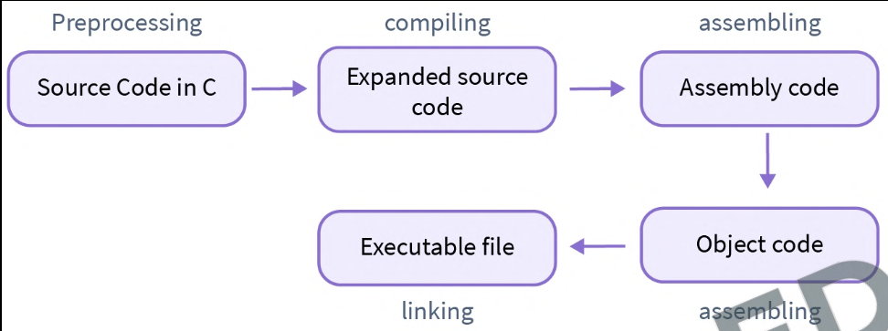

# C Programming Notes 🔥⚡📝

Video Completed: [02:30:28](https://youtu.be/p0QUmC2WJwM?t=9028)

## 0️⃣1️⃣ Chapter-01 (Completed✅)

### 🧑‍💻 Developer Environment:

👉 `VS Code + MSYS2 (GCC/G++)`

- [VS Code](https://code.visualstudio.com/) => It is a Code Editor Developed by Microsoft. It is mostly loved Code Editor among developers today. We need to install some extensions to make it more comfortable to write and run C Code. The list of extensions is:

  - [C/C++](https://marketplace.visualstudio.com/items?itemName=ms-vscode.cpptools) => The C/C++ extension adds language support for C/C++ to Visual Studio Code, including editing (IntelliSense) and debugging features.
  - [Code Runner](https://marketplace.visualstudio.com/items?itemName=formulahendry.code-runner) => To run C Code in terminal automatically.

- [MSYS2](https://github.com/msys2/msys2-installer/releases/download/2024-05-07/msys2-x86_64-20240507.exe) => MSYS2 is a collection of tools and libraries providing you with an easy-to-use environment for building, installing and running native Windows software. Basically it is to install the `C Compiler (GCC/G++)` without any hassle.

### 👉 Showing Output in C:

- <u>**Printf Function:**</u> The `printf` function is used to show output in C. It allows you to display text and variables to the console. Syntax:

  ```c
  printf("formatted string", variable_1, variable_2,...);
  ```

- <u>**Displaying Text:**</u> To print any text using printf. Just enclose the massage/text in double quotes. Syntax:

  ```c
  printf("Hello, C Program!!");
  ```

- <u>**New Line:**</u> Use `\n` within the string to move to a new line. Syntax:

  ```c
  printf("Hello, \nC Program!!");
  ```

- <u>**Inserting Variable Values:**</u> We need to use `formate specifiers` to insert variable values inside the string. Like:
  - `%d` or `%i` => For Integers.
  - `%c` => For Characters.
  - `%f` => For Floating Point Values.
  - `%lf` => For Double Values.

### 👉 Importance of Main Method/Function:

- <u>**Entry Point:**</u> It's the entry point of a C program, where the execution starts. When a C program is executed, the execution starts from the main function.
- <u>**Required:**</u> Every executable C Program must have a main function.
- <u>**Return Type:**</u> A successful program execution returns 0 to the OS and a unsuccessful program execution returns a non-zero value.
- <u>**Fixed Name:**</u> The name main is recognized as the programmes starting point by the compiler.

### 👉 Comments in C:

- Used to add notes in Code.
- Not consider as the part of code.
- Helpful for Code organization.
- Usually written for the Developers.
- There are `2 types of comments in C`:
  1. Single Line Comment.
     ```c
     // This is a single line comment.
     ```
  2. Multi Line Comment.
     ```c
     /*
     This is a
     Multi Line
     Comment.
     */
     ```

### 👉 Manually Compile a C Program.

```bash
gcc file_name.c -o output_file_name
```

### 👉 How C Program is Compiled.



- <u>**Pre-processing:**</u> Processes directives (like #include #define) before compilation, and modifies the source code according to it.
- <u>**Compiling:**</u> Transforms source code written in high level language into assembly language.
- <u>**Assembling:**</u> Converts code written in assembly language to Machine Code/ Object Code.
- <u>**Linking:**</u> Combines multiple object files into a single executable or library, resolving references between them.

## 0️⃣2️⃣ Chapter-02

### 👉 Variables:

Variables are like containers for storing data values. But actually `Variables are names given to a memory location in the memory or ram.` Syntax to write variables in C:

```c
// data_type variable_name = variable_value;
int age = 22;
```

### 👉 Data Type:

There are basically `3 Types of Data Type` in C.

1. Fundamental Data Type.

   - Integer
     - int
     - char
   - Float
     - float
     - double
   - Void

2. Derived Data Type.

   - Array
   - Function
   - Pointers

3. User Define Data Type.

   - Structure
   - Union
   - Enum
   - Typedef

Commonly Used Data Types:

| Data Type |  Size   | Formate Specifier |
| :-------- | :-----: | :---------------: |
| char      | 1 Bytes |        %c         |
| short int | 2 Bytes |    %hd or %hi     |
| int       | 4 Bytes |     %d or %i      |
| float     | 4 Bytes |        %f         |
| long int  | 8 Bytes |        %ld        |
| double    | 8 Bytes |        %lf        |

### 👉 Rules for naming variables:

1. Variable names can only contain letter, digits and underscore.
2. Variable names can't start with a number. It can only start with a letter or underscore.
3. Variable names are case sensitive. (`myname` and `nyName` is not same)
4. Variable names cannot contain white spaces or special characters like !, #, %, etc.
5. Key Words can not be used as variable names.

### 👉 Declaring a Constant Variable:

Constant value means giving a value to a variable that can not be changed or re-declared. There are basically 2 ways to declare a constant variable in C:

1. Using `#define`
2. Using `const` keyword

- <u>**#define:**</u> To use #define you need to use it before main function and after #include. Syntax:

  ```c
  // #define variable_name variable_value

  #define PI 3.1416
  ```

- <u>**Const:**</u> To use const keyword you need to just add `const` before the variable declaration. Syntax:

  ```c
  // const data_type variable_name = variable_value;

  const float PI = 3.1416;
  ```

### 👉 C Keywords:

Keywords are predefined, reserved words used in programming that have special meanings to the compiler. Keywords are part of the syntax and they cannot be used as an identifier.

As C is a case sensitive language, all keywords must be written in lowercase. Here is a list of all keywords allowed in ANSI C.

|          |        |          |          |
| :------: | :----: | :------: | :------: |
|   auto   | double |   int    |  struct  |
|  break   |  else  |   long   |  switch  |
|   case   |  enum  | register | typedef  |
|   char   | extern |  return  |  union   |
| continue |  for   |  signed  |   void   |
|    do    |   if   |  static  |  while   |
| default  |  goto  |  sizeof  | volatile |
|  const   | float  |  short   | unsigned |

### 👉 Escape Sequence:

The escape sequence in C is the characters or the sequence of characters that can be used inside the string literal. The purpose of the escape sequence is to represent the characters that cannot be used normally using the keyboard.

The table below lists some common escape sequences in C language:

| Escape Sequence | Description                                                  |
| :-------------: | :----------------------------------------------------------- |
|       \n        | To insert a `New Line` in the string at this point.          |
|       \t        | To insert a `Tab` in the string at this point.               |
|       \b        | To insert a `Backspace` in the string at this point.         |
|       \"        | To insert a `Double Quote` line in the string at this point. |
|       \'        | To insert a `Single Quote` line in the string at this point. |
|       \\        | To insert a `Backslash` line in the string at this point.    |

### 👉 User Input in C:

To take user input in C we use `scanf()` function.

Syntax:

```c
// scanf("formate_specifier", &variable_to_store);

scanf("%d", &num_1);

```

## 0️⃣3️⃣ Chapter-03

### 👉 C Instructions:

There are basically 3 types of instructions in C:-

1. <u>**Type Declaration Instructions:**</u> To declare the type of the variable used in a C Program.
2. <u>**Arithmetic Instructions:**</u> To perform arithmetic operations between constants and variables.
3. <u>**Control Instructions:**</u> To control the sequence of execution of various statements in a C Program.

### 👉 Assignment Operator:

Assign the right-hand operand's value to the left-hand operand. For example:

```c
int age = 23;
```

### 👉 Basic Arithmetic Operators:

| Operators |    Meaning     | Example | Result  |
| :-------: | :------------: | :-----: | :-----: |
|     +     |    Addition    |  5 + 2  |    7    |
|     -     |  Subtraction   |  5 - 2  |    3    |
|    \*     | Multiplication | 5 \* 2  |   10    |
|     /     |    Division    |  5 / 2  | 2 (2.5) |
|     %     |     Modulo     |  5 % 2  |    1    |

### 👉 Integer and Float Conversion:

| Operation                  | Answer  |
| :------------------------- | :-----: |
| `int` (operator) `int`     |  `int`  |
| `int` (operator) `float`   | `float` |
| `float` (operator) `int`   | `float` |
| `float` (operator) `float` | `float` |

Example:

| Operation   | Answer |
| :---------- | :----: |
| `5 / 2`     |  `2`   |
| `5.0 / 2`   | `2.5`  |
| `5 / 2.0`   | `2.5`  |
| `5.0 / 2.0` | `2.5`  |

### 👉 Type Conversion:

There is 2 types of type conversion in C:

1. <u>**Implicit Conversion:**</u> C automatically converts one data type to another when needed. Example: int to float during operations.
2. <u>**Explicit Conversion:**</u> The programmer forcefully converts one data type to another. Syntax:

   ```c
    // (data_type) variable

    float a = 5 / (float) 2; // Output: 2.500000
   ```

### 👉 Precedency / Hierarchy of Operators:

We can easily memorize it using `BODMAS`.

- `B` => Brackets.
- `O` => Order.
- `D` => Divide.
- `M` => Multiply.
- `A` => Addition.
- `S` => Subtraction.

But there is a small change:

| Priority | Operators |
| :------: | :-------: |
|   1st    |    ( )    |
|   2nd    | \*, /, %  |
|   3rd    |   +, -    |
|   4th    |     =     |

### 👉 Associativity of Operator:

`Left to Right`

### 👉 Short Hand Operators:

| Operator | Name of the Operator        | Example  | Equivalent Constructor |
| :------: | :-------------------------- | :------: | :--------------------: |
|    +=    | Addition Assignment         | `a += 2` |      `a = a + 2`       |
|    -=    | Subtraction Assignment      | `a -= 2` |      `a = a - 2`       |
|   \*=    | Multiplication Assignment   | `a *= 2` |      `a = a * 2`       |
|    /=    | Division Assignment         | `a /= 2` |      `a = a / 2`       |
|    %=    | Modulo/Remainder Assignment | `a %= 2` |      `a = a % 2`       |

### 👉 Unary Operators:

|     Operator      | Description                                                   | Example |
| :---------------: | :------------------------------------------------------------ | :-----: |
|        `-`        | Convert a Positive Value to a negative                        |   -y    |
|  `Pre Increment`  | Increment the value by 1 and use it in our statement          |   ++y   |
|  `Pre Decrement`  | Decrement the value by 1 and use it in our statement          |   --y   |
| `Post Increment`  | Use current value in the statement and then Increment it by 1 |   y++   |
| `Poste Decrement` | Use current value in the statement and then Decrement it by 1 |   y--   |
